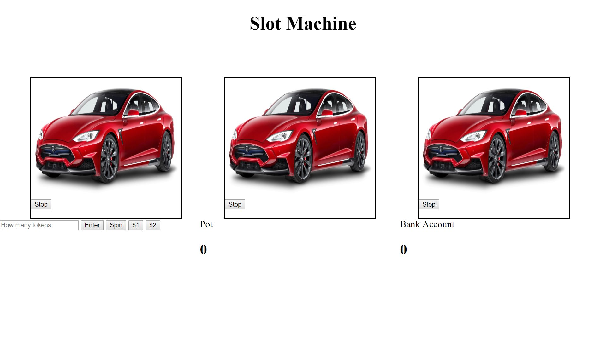

Slot Machine

This project is a simple slot machine with cars that allows the user to purchase tokens and use those tokens to bet on a spin of 3 cars. To win your money you put in have to stop the spin on the same car 2 out of 3 spins but if you get all three spins to match you win the pot if you do neither you lose.

Demo:https://rakimdevcraig.github.io/Slot-Machine/

How It's Made:

Tech used: Html, CSS, Jquery, Javascript

This project was the hardest one i've completed due to the amount of features that went into it but I did this as part of a team so we were able to work together. First we needed to get the 3 cars or wheels to spin together to do that we put all of the cars into an array and linked them to a click event. Once getting the wheels to spin we had to get them to also
stop we did that the same way as getting all of them to spin which was by tying them to a click event. After that we had to decide what form of payment users were going to play the game with, we decided to have small $1 and $2 bets. After deciding that we made sure that the user couldn't play the game if they didn't use any money we did that by adding a conditional and alerting the user if they didn't spend any money. After that we decided the winning conditions one which the user would get their money back if they match 2 out of 3 cars and the ultimate winning condition where they win the
whole pot if they match up all 3 cars.

Optimizations:
At first we had one winning condition which was if all of the cars matched up you won the pot. After some testing and we realized users wouldn't win our game enough and therefore would be pushed away from. To combat this we slowed down the speed of the spins so it was a tad easier to match up all of the cars and we added a condition to win if you matched 2 cars because users were experiencing that alot.

Lessons Learned:
This was the hardest project i've completed to date. This one was tough because we not only had to get all 3 wheels spinning together at the same time which was our biggest challenge but we also had to stop them at the same time. I got some good work doing conditionals in this project also to decide multiple winning conditions. I also learned that even though I made something as fun as this there's still ways to learn numerous things all while enjoying myself this project didn't feel like work at all it was just a bunch of fun.

Examples:
